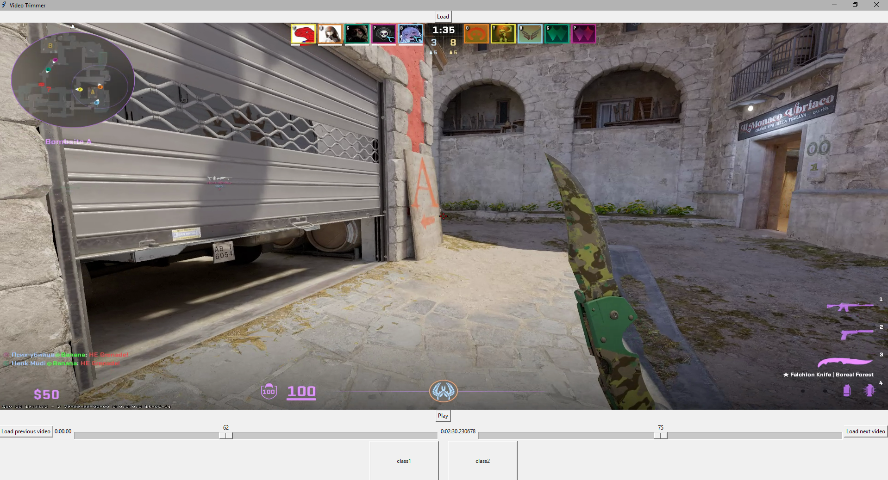

# Video-Trimmer
This a repository of a code I wrote that helps with short video labeling, for action detection models!

---
## How to start
Start Project by downloading the requirements.txt

`pip install -r requirements.txt` 

and downloading `ffmpeg`, then resarting after adding it to the PATH.

Then create the class name directories in the same directory as the code, then run!

---
## How to use

Press the `load` button to choose a directory with .mp4 videos, then use the `Play/Pause` to play or pause the video.

The left bar controls the video and is the lower bound (the first part you want to start your trim) and the second bar is used 
to control the upper bound (the final second to be trimmed), once a valid trim is highlighted, you can press any of the `folder`
buttons that are at the bottom of the screen, it'll save the trim to that folder, and also save the name of the class.

Once you're done with a video, you can press the `load next video` to load the next video in the directory you've selected,
or press the `load previous video` button to load the past video in the directory!

### PLEASE NOTE, KEEP THE WINDOW MAXIMIZED, BUGS ARE COMMON WHEN NOT MAXIMIZED, I'll try to fix them as soon as possible!
